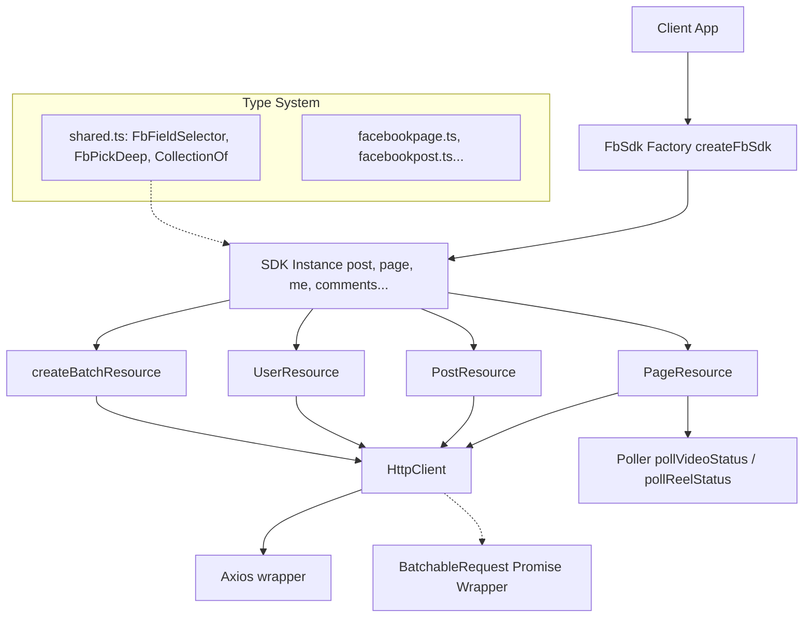

# @tabsircg/fb-sdk Architecture

This document provides a deep technical overview of the Facebook SDK implementation.

## System Overview

## Module / Layer Breakdown

### 1. The Core Factory (`src/client.ts`)
**Purpose:** Serves as the library entry point and dependency injector.
**Inputs:** `FbSdkConfig` (optional store configuration) and an access token.
**Outputs:** An instantiated SDK object containing bound resources (methods: `post`, `page`, `comment`, `me`, `http`, `batch`).
**Side Effects:** Instantiates an Axios `HttpClient` with the provided token attached to every request.

### 2. HTTP Client & Batchable Adapter (`src/httpClient.ts`, `src/internal/batchable.ts`)
**Purpose:** Abstracts away raw network calls and introduces the core batching primitive.
**Inputs:** Relative Graph API paths, query params/body, HTTP options.
**Outputs:** 
- A `BatchableRequest<T>` which is a "thenable" (a faux-Promise). 
- If `await`ed, it resolving the request normally via Axios.
- It exposes `{ method, relative_url }` synchronously to be consumed by `batch()`.
**Side Effects:** Performs network I/O. Intercepts and transforms request objects (camelCase → snake_case) and response objects (snake_case → camelCase) using `transformCase.ts`.

### 3. Case Transformation (`src/lib/transformCase.ts`)
**Purpose:** The single boundary layer reconciling Facebook's `snake_case` API with TypeScript's convention of `camelCase`.
**Inputs:** Objects, deeply nested arrays, or `FormData`.
**Outputs:** Cloned structures with keys correctly formatted.
**Why it matters:** Without this, the heavily automated type system (`KeysToCamel`, `SnakeToCamel`) would desync from the runtime values.

### 4. Graph API Resources (`src/resources/`)
**Purpose:** Business logic mappings to Facebook endpoints (`/v25.0/{id}/...`). Each resource factory (`createPageResource`, `createPostResource`) takes the `HttpClient` and a target `id`.
**Side Effects:** `PageResource.ts` handles complex side effects like file stream reading for video/reel thumbnails and orchestration of multi-phase uploads (`StartUploadSession` → `UploadFile` → `FinishUploadSession`).

### 5. Polling & Error Utilities (`src/internal/poller.ts`, `src/internal/error.ts`)
**Purpose:** Handles Facebook's asynchronous media processing pipeline. Uploading a video returns an ID immediately, but the video isn't published until Facebook finishes server-side encoding.
**Inputs:** A fetcher function and limits (max attempts, interval).
**Outputs:** A resolved value if the phase equals `complete`, or it throws a custom `FacebookUploadError`.
**Edge Cases Handled:** Prevents zombie polling by enforcing max timeouts (default 30 attempts, varying intervals). It traverses Facebook's nested phase error reporting (`uploadingPhase` vs `processingPhase` vs `publishingPhase` statuses).

### 6. The Type System (`src/types/`)
**Purpose:** Enforces compile-time guarantees on runtime queries.
**Key Interfaces:**
- `FbFieldSelector<T>`: A recursive mapped type that converts a TypeScript interface (`FacebookPost`) into a boolean selector map. 
- `FbPickDeep<T, F>`: Takes the original model `T` and the active selector `F`, returning a deeply pruned version of `T` containing *only* what was selected.
- `CollectionOf<T>`: A phantom-type wrapper representing paginated Facebook responses. It signals to `FbFieldSelector` that sub-selectors should be wrapped in `fields: {}` and `options: {}` (for cursors/limits) rather than a direct boolean.
**Why They're Shaped This Way:** The Graph API allows nested field masking (e.g., `?fields=message,comments.order(chronological).limit(5){message,from}`). The SDK replicates this structure strictly in TypeScript via `options` and `fields` sub-objects, parsed recursively by `toGraphFields()` in `utils.ts`.

## Data Flow Walkthrough: Fetching Nested Data

Imagine parsing the following: `sdk.page("123").posts.list({ fields: { message: true, comments: { fields: { message: true } } } })`

1. The `list` function maps this to an `http.get` against `/123/posts`.
2. The `query.fields` object is passed into `toGraphFields()` (`src/internal/utils.ts`).
3. `toGraphFields` recursively builds the string: `message,comments{message}`. If `comments` had `options: { limit: 5 }`, it would output `message,comments.limit(5){message}`.
4. `http.get` merges these params with the `access_token` and calls Axios. 
5. During the return, `toCamel` deeply clones the JSON response, altering any `snake_case` keys (like `created_time`) into `createdTime`.
6. The user receives a strongly-typed object where `typescript` knows exactly which fields exist based on their original `.list()` invocation mapping cleanly back to `FbPickDeep`.

## Non-Obvious Design Decisions
- **`BatchableRequest` faux-Promises:** The SDK prevents the N+1 API call problem via a custom `Thenable` implementation. Because the result object implements `.then` and `.catch`, V8 treats it like a Promise in `await` contexts. However, `batch` avoids `await`ing them directly, instead pulling the synchronously populated `method` and `relative_url` fields off the object to build a unified `multipart/form-data` batch request JSON (`createBatchResource.ts`).
- **Webhook Store Injection:** The `PageCommentResouorce.ts` (note: typo in the filename) exports a `fetchComments` aggregator. Polling an entire page's post history for new comments is rate-limited. The SDK accepts a `Store` implementation (e.g., Redis). When a Facebook Webhook fires (`webhook/handler.ts`), it logs the `post_id` to the store. The `PageCommentResource` can then fetch only the `active` posts from the store to reduce API footprint.

## Structural Vulnerabilities
- If `transformCase.ts` is bypassed or fails on an edge-case structure (like deeply nested binary data inside a generic object), the entire runtime type mapping breaks, causing `undefined` errors everywhere.
- The typing engine `DeepStrict` and recursive `FbPickDeep` relies on TS5 features limits. Exceeding a depth of `5` (enforced via `Decrement` tuple) terminates type resolution to avoid `Type instantiation is excessively deep` compilation errors. If a user needs 6 levels of nesting, they lose type inference at the leaf nodes.
